# TalkingCanvas - Complete Ubuntu Deployment Guide (Local + Public Internet Access)

> **Last Updated:** 22 December 2025 | **Ubuntu:** 22.04 / 24.04 LTS | **Docker:** 29.1.x

This is a **complete, copy-paste-ready guide** to deploy TalkingCanvas on your Ubuntu laptop (22.04 LTS or 24.04 LTS) with 8GB RAM. **No prior DevOps experience required!**

> [!TIP]
> **For absolute beginners:** This guide is designed so you can copy-paste every command exactly as shown. You'll learn what each command does as you go!

**After completing this guide:**
- ✅ Anyone on your **local WiFi network** can access the application
- ✅ Anyone **on the internet** (India or globally) can access it from their phone, tablet, or computer using the provided public URL

---

## 📋 Table of Contents

1. [What You're Building](#what-youre-building)
2. [Before You Start (Prerequisites)](#before-you-start-prerequisites)
3. [Phase 1: System Preparation](#phase-1-system-preparation)
4. [Phase 2: Install Docker](#phase-2-install-docker-official-method-for-ubuntu-2404)
5. [Phase 3: Get the Project](#phase-3-get-the-project)
6. [Phase 4: Configure Environment](#phase-4-configure-environment)
7. [Phase 5: Deploy!](#phase-5-deploy)
8. [Phase 6: Test Everything](#phase-6-test-everything)
9. [Access from Other Devices (Local WiFi)](#access-from-other-devices)
10. [🌐 **NEW: Public Internet Access**](#public-internet-access)
11. [Optional: Keep It Running 24/7](#optional-keep-it-running-247)
12. [Daily Commands Cheat Sheet](#daily-commands-cheat-sheet)
13. [Troubleshooting](#troubleshooting)

---

## What You're Building

```mermaid
graph TB
    subgraph "Your Ubuntu Laptop"
        subgraph "Docker Containers"
            DB[(🗄️ PostgreSQL 17<br/>Database)]
            BE[☕ Spring Boot<br/>Backend API<br/>Port 8088]
            FE[🅰️ Angular + Nginx<br/>Frontend<br/>Port 4200]
        end
    end
    
    subgraph "Your WiFi Network"
        PHONE[📱 Phone]
        TABLET[📱 Tablet]
        PC[💻 Other PC]
    end
    
    BE --> DB
    FE --> BE
    PHONE -->|http://YOUR_IP:4200| FE
    TABLET -->|http://YOUR_IP:4200| FE
    PC -->|http://YOUR_IP:4200| FE
```



**Tech Stack:**
| Component | Technology | Version |
|-----------|------------|---------|
| Database | PostgreSQL | 17 (Alpine) |
| Backend | Spring Boot + Java | 21 |
| Frontend | Angular + Nginx | Node 20 |
| Container | Docker Engine | 29.1.x |

**Time Required:** 30-45 minutes (mostly waiting for downloads)

**Cost:** ₹0 (FREE!)

---

## Before You Start (Prerequisites)

### What You Need

| Requirement | How to Check | ✅ Your Status |
|-------------|--------------|----------------|
| Ubuntu 22.04 or 24.04 LTS | `lsb_release -a` | Check now |
| 8GB+ RAM | `free -h` | You have this ✅ |
| 20GB free disk | `df -h /` | 500GB SSD ✅ |
| Internet connection | Try to open google.com | Check now |
| Admin (sudo) access | `sudo whoami` → should say "root" | Check now |

### Open Terminal

Press **`Ctrl + Alt + T`** to open Terminal. Keep this window open throughout the entire guide.

> [!TIP]
> You can copy commands from this guide and paste them in Terminal using **`Ctrl + Shift + V`** (not Ctrl+V).

---

## Phase 1: System Preparation

### Step 1.1: Update Your System

```bash
sudo apt update && sudo apt upgrade -y
```

**What this does:** Downloads the latest package lists and upgrades all installed software.

**Expected time:** 1-5 minutes (depends on your internet speed and pending updates)

**You might see:** A list of packages being updated. If asked any questions, just press `Enter` to accept defaults.

### Step 1.2: Install Essential Tools

```bash
sudo apt install -y git curl wget ca-certificates gnupg lsb-release
```

**What this does:** Installs tools we'll need for Docker installation and Git for getting the project.

---

## Phase 2: Install Docker (Official Method for Ubuntu 22.04/24.04)

> [!IMPORTANT]
> **Do NOT use** `sudo apt install docker.io` - it installs an outdated version that may have issues.
> 
> Follow these exact steps to install the latest Docker from the official Docker repository.

> [!NOTE]
> **These commands work on both Ubuntu 22.04 (Jammy Jellyfish) and Ubuntu 24.04 (Noble Numbat).**
> The commands automatically detect your Ubuntu version and configure Docker accordingly.

### Step 2.0: Verify Your Ubuntu Version (Quick Check)

Run this to confirm your Ubuntu version:

```bash
lsb_release -a
```

**Expected output (one of these):**
```
Distributor ID: Ubuntu
Description:    Ubuntu 22.04.x LTS   # This is fine!
...
```
OR
```
Distributor ID: Ubuntu
Description:    Ubuntu 24.04.x LTS   # This is also fine!
...
```

### Step 2.1: Remove Any Old Docker Versions

```bash
for pkg in docker.io docker-doc docker-compose docker-compose-v2 podman-docker containerd runc; do 
    sudo apt-get remove -y $pkg 2>/dev/null
done
```

**What this does:** Removes any previously installed Docker versions to prevent conflicts. Safe to run even if you never installed Docker before.

### Step 2.2: Add Docker's Official GPG Key

```bash
# Create directory for keyrings
sudo install -m 0755 -d /etc/apt/keyrings

# Download Docker's official GPG key
sudo curl -fsSL https://download.docker.com/linux/ubuntu/gpg -o /etc/apt/keyrings/docker.asc

# Make the key readable
sudo chmod a+r /etc/apt/keyrings/docker.asc
```

**What this does:** Adds Docker's security key so your system trusts packages from Docker.

### Step 2.3: Add Docker Repository

```bash
# Add Docker's repository to apt sources
sudo tee /etc/apt/sources.list.d/docker.sources <<EOF
Types: deb
URIs: https://download.docker.com/linux/ubuntu
Suites: $(. /etc/os-release && echo "${UBUNTU_CODENAME:-$VERSION_CODENAME}")
Components: stable
Signed-By: /etc/apt/keyrings/docker.asc
EOF

# Update package list to include Docker repository
sudo apt update
```

**What this does:** Tells Ubuntu where to find Docker packages.

### Step 2.4: Install Docker Engine

```bash
sudo apt install -y docker-ce docker-ce-cli containerd.io docker-buildx-plugin docker-compose-plugin
```

**What this does:** Installs:
- `docker-ce` → Docker Engine (the main program)
- `docker-ce-cli` → Command-line interface
- `containerd.io` → Container runtime
- `docker-buildx-plugin` → Build toolkit
- `docker-compose-plugin` → Run multi-container apps (we need this!)

**Expected time:** 2-5 minutes

### Step 2.5: Allow Docker Without sudo

```bash
# Add your user to the docker group
sudo usermod -aG docker $USER
```

> [!CAUTION]
> **IMPORTANT: You MUST apply this change!** Do ONE of these:
> 
> **Option A (Quick):** Run this command:
> ```bash
> newgrp docker
> ```
> 
> **Option B (Recommended):** Log out and log back in to Ubuntu.

### Step 2.6: Verify Docker Installation

```bash
# Check Docker version
docker --version
```

**Expected output (December 2025):**
```
Docker version 29.1.3, build xxxxxxx
```

```bash
# Check Docker Compose version
docker compose version
```

**Expected output:**
```
Docker Compose version v2.32.x
```

> [!NOTE]
> **Important:** Docker Compose V2 uses `docker compose` (with a **space**), NOT `docker-compose` (with a hyphen). The old syntax is deprecated.

### Step 2.7: Test Docker Works

```bash
docker run hello-world
```

**Expected output:**
```
Hello from Docker!
This message shows that your installation appears to be working correctly.
...
```

> [!WARNING]
> If you get "permission denied", you skipped Step 2.5. Either run `newgrp docker` or log out and log back in, then try again.

🎉 **Docker is installed!** You're halfway there.

---

## Phase 3: Get the Project

### Step 3.1: Navigate to Your Preferred Location

```bash
# Go to your Desktop (or wherever you want the project)
cd ~/Desktop
```

### Step 3.2: Clone the Repository

**If you already have the project folder** (e.g., you copied it from somewhere or already cloned it), skip this step and just navigate to it.

**If you need to clone from GitHub:**

```bash
# Option A: If you have your own fork/copy on GitHub
git clone https://github.com/YOUR_GITHUB_USERNAME/TalkingCanvas-ws.git

# Option B: If you're cloning from the original repository
# Ask your team lead or check your GitHub for the correct URL
```

> [!TIP]
> **Don't have access to GitHub?** If you received the project as a ZIP file or USB drive:
> 1. Copy the folder to your Desktop
> 2. Skip to Step 3.3
>
> **Finding the correct GitHub URL:**
> 1. Go to GitHub.com and navigate to the repository
> 2. Click the green "Code" button
> 3. Copy the HTTPS URL shown there

### Step 3.3: Enter the Project Directory

```bash
cd TalkingCanvas-ws
```

### Step 3.4: Verify Required Files Exist

```bash
ls -la
```

**You MUST see these files:**
- ✅ `docker-compose.yml` → Defines all containers
- ✅ `Dockerfile` → Backend build instructions
- ✅ `.env.example` → Environment template
- ✅ `client/` → Frontend folder
- ✅ `client/Dockerfile` → Frontend build instructions

**If any file is missing, run:**
```bash
git pull origin main
```

---

## Phase 4: Configure Environment

### Step 4.1: Find Your Laptop's IP Address

```bash
ip addr show | grep -E "inet (192\.|10\.|172\.)" | head -1 | awk '{print $2}' | cut -d'/' -f1
```

**Example output:** `192.168.1.105`

**Alternative command:**
```bash
hostname -I | awk '{print $1}'
```

> [!IMPORTANT]
> **Write down your IP address!** You'll need it in the next step.
> 
> Example: `192.168.1.105` ← Replace with YOUR actual IP.

### Step 4.2: Generate a Secure JWT Secret

```bash
openssl rand -base64 64 | tr -d '\n' && echo
```

**Example output:**
```
K7dF9xMnP2qR4sT6uW8yA0bC3eG5hI7jL9mN1oP4rS6tU8vX0zA2bD4fG6hJ8kL0mN2pQ4sT6vX8yB0dF2hJ4lN6pR8tV0xZ2a==
```

> [!IMPORTANT]
> **Copy this entire output!** You'll paste it in step 4.4.

### Step 4.3: Create the Environment File

```bash
# Copy the template
cp .env.example .env
```

### Step 4.4: Edit the Environment File

```bash
nano .env
```

**Replace ALL contents with this** (edit the highlighted values):

```env
# ===========================================
# DATABASE PASSWORD
# ===========================================
# Change this to any secure password you want
DB_PASSWORD=MySecure2025Password!

# ===========================================
# JWT SECRET (REQUIRED - Paste your generated secret)
# ===========================================
JWT_SECRET=PASTE_YOUR_GENERATED_SECRET_HERE

# ===========================================
# MAIL (Optional - Skip if you don't need password reset emails)
# ===========================================
# MAIL_USERNAME=your-email@gmail.com
# MAIL_PASSWORD=your-app-password

# ===========================================
# CORS ALLOWED ORIGINS (REQUIRED for network access)
# ===========================================
# Replace 192.168.1.105 with YOUR actual IP address
CORS_ORIGINS=http://localhost:4200,http://localhost:8088,http://localhost,http://192.168.1.105:4200,http://192.168.1.105:8088
```

**How to save in nano:**
1. Press `Ctrl + O` (letter O, not zero)
2. Press `Enter` to confirm filename
3. Press `Ctrl + X` to exit

### Step 4.5: Verify Your .env File

```bash
cat .env
```

**Check that:**
- ✅ `DB_PASSWORD` has your custom password
- ✅ `JWT_SECRET` has a long random string (not the placeholder)
- ✅ `CORS_ORIGINS` includes your actual IP address (e.g., `192.168.1.105`)

---

## Phase 5: Deploy!

### Step 5.1: Build and Start All Containers

```bash
docker compose up -d --build
```

**What the flags mean:**
- `up` → Start the containers
- `-d` → Run in background (detached mode)
- `--build` → Build images before starting

> [!NOTE]
> **First-time build takes 12-20 minutes** on 8GB RAM. Here's what happens:
> 
> 1. Downloads base images (PostgreSQL, Java, Node, Nginx) - ~3-5 min
> 2. Builds Spring Boot backend (Maven downloads dependencies, compiles Java) - ~5-8 min
> 3. Builds Angular frontend (npm install, Angular build) - ~3-5 min
> 4. Starts all containers - ~30 sec
> 
> ☕ **Go get some coffee!** The terminal will show lots of text scrolling - that's normal!

> [!WARNING]
> **Don't close the terminal** while building! If it seems stuck, wait at least 5 more minutes. 
> The Angular build in particular can appear "frozen" at certain percentages - this is normal.

### Step 5.2: Watch the Build Progress (Optional)

Open a **new terminal tab** (`Ctrl + Shift + T`) and run:

```bash
docker compose logs -f
```

This shows live logs. Press `Ctrl + C` to stop watching (containers keep running).

### Step 5.3: Check Container Status

```bash
docker compose ps
```

**Expected output (all three should show "Up"):**
```
NAME                      STATUS              PORTS
talkingcanvas-db          Up (healthy)        0.0.0.0:5433->5432/tcp
talkingcanvas-backend     Up (healthy)        0.0.0.0:8088->8088/tcp
talkingcanvas-frontend    Up                  0.0.0.0:4200->80/tcp
```

> [!CAUTION]
> If any container shows `Restarting` or `Exit`, see the [Troubleshooting](#troubleshooting) section.

---

## Phase 6: Test Everything

### Test 1: Backend Health Check

```bash
curl http://localhost:8088/api/actuator/health
```

**Expected output:**
```json
{"status":"UP"}
```

### Test 2: Frontend Loads

Open **Firefox** (or your browser) and go to:

```
http://localhost:4200
```

**Expected:** You should see the TalkingCanvas homepage!

### Test 3: Login Works

On the website, try logging in with:
- **Email:** `admin@talkingcanvas.com`
- **Password:** `Admin@123`

**Expected:** You should reach the admin dashboard.

> [!CAUTION]
> **Change this admin password immediately** after first login!

🎉 **Deployment Complete!** Your TalkingCanvas is running locally.

---

## Access from Other Devices

### From Your Laptop

| Service | URL |
|---------|-----|
| 🌐 Website | http://localhost:4200 |
| 📚 API Docs (Swagger) | http://localhost:8088/api/swagger-ui.html |
| ❤️ Health Check | http://localhost:8088/api/actuator/health |

### From Phone/Tablet/Other Computers

Make sure the device is connected to the **same WiFi network** as your laptop.

Replace `192.168.1.105` with your laptop's actual IP:

| Service | URL |
|---------|-----|
| 🌐 Website | http://192.168.1.105:4200 |
| 📚 API Docs | http://192.168.1.105:8088/api/swagger-ui.html |

### If Other Devices Can't Connect

**Check if Ubuntu Firewall is blocking:**

```bash
sudo ufw status
```

**If it says "active", allow the ports:**

```bash
sudo ufw allow 4200/tcp
sudo ufw allow 8088/tcp
sudo ufw reload
```

---

## Public Internet Access

> [!IMPORTANT]
> **Goal:** After completing this section, anyone on the internet (India or globally) can access your TalkingCanvas website from any device using a public URL like `https://talkingcanvas.yourdomain.com` or a tunnel URL.

### Understanding Your Options

| Method | Difficulty | Cost | Pros | Cons |
|--------|------------|------|------|------|
| 🥇 **Cloudflare Tunnel** | Easy | FREE | Secure HTTPS, no port forwarding, works behind any ISP | Requires free Cloudflare account |
| 🥈 **ngrok** | Very Easy | FREE (limited) | Instant URL, no config | URL changes on restart (paid for fixed URL) |
| 🥉 **Port Forwarding + DDNS** | Medium | FREE | Full control | Requires router access, less secure |

> [!TIP]
> **Recommended for Beginners:** Use **Cloudflare Tunnel** (Method 1) - it's FREE, secure, gives you HTTPS automatically, and works even if your ISP blocks incoming connections.

---

### Method 1: Cloudflare Tunnel (RECOMMENDED - FREE & Secure)

Cloudflare Tunnel creates a secure outbound connection from your laptop to Cloudflare's network, then routes internet traffic to your app. No port forwarding needed!

#### Step 1.1: Get a Free Domain (if you don't have one)

**Option A: Use Freenom/Afraid.org (100% Free)**
- Go to https://freedns.afraid.org/ and create a free subdomain

**Option B: Buy a cheap domain (~₹100-800/year)**
- Namecheap: https://www.namecheap.com
- Cloudflare Registrar: https://www.cloudflare.com/products/registrar/

For this guide, we'll assume you have a domain like `yourdomain.com`.

#### Step 1.2: Create a Cloudflare Account

1. Go to https://dash.cloudflare.com/sign-up
2. Create a **FREE** account
3. Add your domain to Cloudflare (follow their instructions to update nameservers)
4. Wait for DNS propagation (can take 5-30 minutes)

#### Step 1.3: Install Cloudflared on Ubuntu

```bash
# Download and install cloudflared
curl -L --output cloudflared.deb https://github.com/cloudflare/cloudflared/releases/latest/download/cloudflared-linux-amd64.deb
sudo dpkg -i cloudflared.deb
rm cloudflared.deb

# Verify installation
cloudflared --version
```

**Expected output:**
```
cloudflared version 2024.x.x (built ...)
```

#### Step 1.4: Authenticate with Cloudflare

```bash
cloudflared tunnel login
```

This opens a browser. Log in to Cloudflare and select your domain. A certificate will be downloaded automatically.

#### Step 1.5: Create the Tunnel

```bash
# Create a tunnel named "talkingcanvas"
cloudflared tunnel create talkingcanvas
```

**Save the Tunnel ID!** It will look like: `a1b2c3d4-e5f6-7890-abcd-ef1234567890`

#### Step 1.6: Configure DNS

```bash
# Point your subdomain to the tunnel
cloudflared tunnel route dns talkingcanvas talkingcanvas.yourdomain.com
```

Replace `yourdomain.com` with your actual domain.

#### Step 1.7: Create Tunnel Config File

```bash
nano ~/.cloudflared/config.yml
```

**Paste this content** (replace YOUR_TUNNEL_ID and YOUR_DOMAIN):

```yaml
tunnel: YOUR_TUNNEL_ID
credentials-file: /home/YOUR_USERNAME/.cloudflared/YOUR_TUNNEL_ID.json

ingress:
  # Frontend (main website)
  - hostname: talkingcanvas.yourdomain.com
    service: http://localhost:4200
  # Backend API
  - hostname: api.talkingcanvas.yourdomain.com
    service: http://localhost:8088
  # Catch-all (required)
  - service: http_status:404
```

**Find your values:**
```bash
# Your username
echo $USER

# Your tunnel ID and credentials file
ls ~/.cloudflared/
```

#### Step 1.8: Update Your .env for CORS

```bash
cd ~/Desktop/TalkingCanvas-ws
nano .env
```

**Update CORS_ORIGINS to include your domain:**

```env
CORS_ORIGINS=http://localhost:4200,http://localhost:8088,http://localhost,http://192.168.1.105:4200,http://192.168.1.105:8088,https://talkingcanvas.yourdomain.com,https://api.talkingcanvas.yourdomain.com
```

**Rebuild containers:**
```bash
docker compose down
docker compose up -d --build
```

#### Step 1.9: Start the Tunnel

```bash
cloudflared tunnel run talkingcanvas
```

**Test it!** Open in any browser worldwide:
- 🌐 **Website:** `https://talkingcanvas.yourdomain.com`
- 📚 **API:** `https://api.talkingcanvas.yourdomain.com/api/swagger-ui.html`

#### Step 1.10: Run Tunnel as a Service (Auto-start)

```bash
sudo cloudflared service install
sudo systemctl enable cloudflared
sudo systemctl start cloudflared

# Check status
sudo systemctl status cloudflared
```

🎉 **Done!** Your app is now accessible globally with FREE HTTPS!

---

### Method 2: ngrok (Easiest for Quick Testing)

ngrok is perfect for quick sharing or testing. FREE tier gives you a random URL that changes on restart.

#### Step 2.1: Install ngrok

```bash
# Download ngrok
curl -s https://ngrok-agent.s3.amazonaws.com/ngrok.asc | \
  sudo gpg --dearmor -o /etc/apt/keyrings/ngrok.gpg
echo "deb [signed-by=/etc/apt/keyrings/ngrok.gpg] https://ngrok-agent.s3.amazonaws.com buster main" | \
  sudo tee /etc/apt/sources.list.d/ngrok.list

sudo apt update && sudo apt install ngrok
```

#### Step 2.2: Create ngrok Account & Get Auth Token

1. Go to https://dashboard.ngrok.com/signup
2. Sign up for FREE
3. Go to https://dashboard.ngrok.com/get-started/your-authtoken
4. Copy your auth token

```bash
ngrok config add-authtoken YOUR_AUTH_TOKEN_HERE
```

#### Step 2.3: Expose Your App

**Terminal 1 - Expose Frontend:**
```bash
ngrok http 4200
```

You'll see output like:
```
Forwarding    https://abc123xyz.ngrok-free.app -> http://localhost:4200
```

**Terminal 2 - Expose Backend (optional, for API access):**
```bash
ngrok http 8088
```

#### Step 2.4: Update CORS for ngrok URLs

```bash
cd ~/Desktop/TalkingCanvas-ws
nano .env
```

Add your ngrok URLs to CORS_ORIGINS:
```env
CORS_ORIGINS=http://localhost:4200,http://localhost:8088,https://abc123xyz.ngrok-free.app,https://def456uvw.ngrok-free.app
```

**Restart containers:**
```bash
docker compose down
docker compose up -d
```

> [!WARNING]
> **ngrok FREE limitations:**
> - URL changes every time you restart ngrok
> - Shows ngrok branding page to first-time visitors
> - 1 online ngrok agent per account
> 
> **For permanent URL:** Upgrade to ngrok paid plan ($8/month) or use Cloudflare Tunnel (free).

---

### Method 3: Port Forwarding + Dynamic DNS (Advanced)

This method requires router access and is less secure, but gives you full control.

> [!CAUTION]
> **Security Warning:** This method exposes your computer directly to the internet. Only use if you understand the risks and have proper security measures in place.

#### Step 3.1: Check if Your ISP Allows Port Forwarding

Many ISPs in India (Jio, Airtel, BSNL) use CGNAT, which blocks incoming connections.

**Test your public IP:**
```bash
curl ifconfig.me
```

**If your IP starts with 100.x.x.x or 10.x.x.x**, you're behind CGNAT and this method WON'T work. Use Cloudflare Tunnel instead.

#### Step 3.2: Set Up Dynamic DNS (DDNS)

Your home IP changes periodically. DDNS gives you a fixed domain name.

**Free DDNS Services:**
- No-IP: https://www.noip.com (requires monthly confirmation)
- DuckDNS: https://www.duckdns.org (fully free, recommended)
- Dynu: https://www.dynu.com

**Example with DuckDNS:**

1. Go to https://www.duckdns.org
2. Log in with Google/GitHub
3. Create a subdomain like `talkingcanvas.duckdns.org`
4. Note your token

**Install DuckDNS updater:**
```bash
mkdir -p ~/duckdns
cd ~/duckdns
nano duck.sh
```

**Paste:**
```bash
#!/bin/bash
echo url="https://www.duckdns.org/update?domains=YOUR_SUBDOMAIN&token=YOUR_TOKEN&ip=" | curl -k -o ~/duckdns/duck.log -K -
```

**Set up cron job:**
```bash
chmod 700 duck.sh
crontab -e
```

**Add this line:**
```
*/5 * * * * ~/duckdns/duck.sh >/dev/null 2>&1
```

#### Step 3.3: Configure Router Port Forwarding

1. Open your router admin page (usually http://192.168.1.1 or http://192.168.0.1)
2. Find "Port Forwarding" or "Virtual Server" settings
3. Add these rules:

| Service | External Port | Internal Port | Internal IP | Protocol |
|---------|---------------|---------------|-------------|----------|
| TalkingCanvas Web | 80 | 4200 | YOUR_LAPTOP_IP | TCP |
| TalkingCanvas API | 8088 | 8088 | YOUR_LAPTOP_IP | TCP |

**Find your laptop's internal IP:**
```bash
hostname -I | awk '{print $1}'
```

#### Step 3.4: Open Firewall Ports

```bash
sudo ufw allow 4200/tcp
sudo ufw allow 8088/tcp
sudo ufw allow 80/tcp
sudo ufw reload
```

#### Step 3.5: Set Up HTTPS with Let's Encrypt (Critical for Security!)

> [!CAUTION]
> **Never run a public website without HTTPS!** User passwords and data will be sent in plain text otherwise.

**Install Certbot and Nginx:**
```bash
sudo apt install -y nginx certbot python3-certbot-nginx
```

**Configure Nginx as reverse proxy:**
```bash
sudo nano /etc/nginx/sites-available/talkingcanvas
```

**Paste:**
```nginx
server {
    listen 80;
    server_name talkingcanvas.duckdns.org;

    location / {
        proxy_pass http://localhost:4200;
        proxy_http_version 1.1;
        proxy_set_header Upgrade $http_upgrade;
        proxy_set_header Connection 'upgrade';
        proxy_set_header Host $host;
        proxy_cache_bypass $http_upgrade;
    }

    location /api {
        proxy_pass http://localhost:8088;
        proxy_http_version 1.1;
        proxy_set_header Host $host;
        proxy_set_header X-Real-IP $remote_addr;
    }
}
```

**Enable the site:**
```bash
sudo ln -s /etc/nginx/sites-available/talkingcanvas /etc/nginx/sites-enabled/
sudo nginx -t
sudo systemctl reload nginx
```

**Get SSL certificate:**
```bash
sudo certbot --nginx -d talkingcanvas.duckdns.org
```

Follow the prompts. Certbot will automatically configure HTTPS.

**Your app is now accessible at:** `https://talkingcanvas.duckdns.org`

---

### 🔒 Security Checklist for Public Internet Access

> [!CAUTION]
> **Before exposing your app to the internet, complete this checklist!**

- [ ] **Changed default admin password** from `Admin@123` to something strong
- [ ] **Strong database password** (20+ characters, random)
- [ ] **Random JWT secret** (64+ characters, generated with `openssl rand -base64 64`)
- [ ] **HTTPS enabled** (automatic with Cloudflare Tunnel or certbot)
- [ ] **Updated .env CORS settings** to only allow your domains
- [ ] **Firewall configured** with `sudo ufw enable`
- [ ] **Regular updates** scheduled: `sudo apt update && sudo apt upgrade -y`
- [ ] **Backup strategy** for database

### Rate Limiting (Recommended)

Add rate limiting to prevent abuse. Edit your backend's application properties or add to nginx:

```nginx
# Add to nginx server block
limit_req_zone $binary_remote_addr zone=one:10m rate=10r/s;

server {
    ...
    location /api {
        limit_req zone=one burst=20 nodelay;
        ...
    }
}
```

---

### Quick Summary: Public Access Methods

| Your Situation | Recommended Method |
|----------------|-------------------|
| Want FREE, secure, permanent URL | **Cloudflare Tunnel** |
| Quick demo/testing only | **ngrok** |
| Full control, have router access, ISP allows port forwarding | **Port Forwarding + DDNS** |
| ISP uses CGNAT (Jio Fiber, many Airtel plans) | **Cloudflare Tunnel** (only option) |

---

## Optional: Keep It Running 24/7

### Prevent Laptop Sleep

**Via GUI:**
1. Open **Settings** → **Power**
2. Set **Screen Blank** to **Never**
3. Set **Automatic Suspend** to **Off** for both Battery and Plugged In

**Via Terminal:**
```bash
# Disable sleep/suspend/hibernate
sudo systemctl mask sleep.target suspend.target hibernate.target hybrid-sleep.target
```

### Auto-Start on Boot

Create a systemd service:

```bash
sudo nano /etc/systemd/system/talkingcanvas.service
```

**Paste this content** (replace `YOUR_USERNAME` with your actual Ubuntu username):

```ini
[Unit]
Description=TalkingCanvas Application
After=docker.service
Requires=docker.service

[Service]
Type=oneshot
RemainAfterExit=yes
WorkingDirectory=/home/YOUR_USERNAME/Desktop/TalkingCanvas-ws
ExecStart=/usr/bin/docker compose up -d
ExecStop=/usr/bin/docker compose down
User=YOUR_USERNAME
Group=docker

[Install]
WantedBy=multi-user.target
```

**To find your username:**
```bash
echo $USER
```

**Enable the service:**

```bash
sudo systemctl daemon-reload
sudo systemctl enable talkingcanvas
```

**Test it:**
```bash
sudo systemctl start talkingcanvas
sudo systemctl status talkingcanvas
```

---

## Daily Commands Cheat Sheet

| What You Want to Do | Command |
|---------------------|---------|
| **Start** the app | `docker compose up -d` |
| **Stop** the app | `docker compose down` |
| **Restart** the app | `docker compose restart` |
| **Rebuild after code changes** | `docker compose up -d --build` |
| **View live logs** | `docker compose logs -f` |
| **View backend logs only** | `docker compose logs -f backend` |
| **Check container status** | `docker compose ps` |
| **Check your IP** | `hostname -I \| awk '{print $1}'` |
| **Enter database shell** | `docker compose exec postgres psql -U postgres -d talkingcanvas` |
| **Stop + delete everything** | `docker compose down -v` ⚠️ Deletes DB data! |

**Quick Database Commands (inside psql):**
```sql
\dt                     -- List all tables
SELECT * FROM users;    -- View users
\q                      -- Exit
```

---

## Troubleshooting

### 🔴 "Permission denied" when running docker

**Cause:** You didn't add yourself to the docker group or didn't apply it.

**Fix:**
```bash
sudo usermod -aG docker $USER
newgrp docker
```

If that doesn't work, **log out of Ubuntu completely** and log back in.

---

### 🔴 "docker compose" command not found

**Cause:** Docker Compose plugin wasn't installed.

**Fix:**
```bash
sudo apt install -y docker-compose-plugin
docker compose version
```

---

### 🔴 Backend container keeps restarting

**Cause:** Usually the database isn't ready or environment variables are wrong.

**Check the logs:**
```bash
docker compose logs backend | tail -50
```

**Common fixes:**

1. **Wait 30 seconds** and check again - database might need time to start

2. **Check your .env file:**
   ```bash
   cat .env
   ```
   Make sure `DB_PASSWORD` matches what's expected and `JWT_SECRET` is set

3. **Restart everything:**
   ```bash
   docker compose down
   docker compose up -d
   ```

---

### 🔴 "Out of memory" or build fails

**Cause:** 8GB RAM is sufficient but might struggle if you have many apps open.

**Fix:**
```bash
# Close browser tabs and other applications

# Restart Docker
sudo systemctl restart docker

# Clean up Docker
docker system prune -f

# Try again
docker compose up -d --build
```

---

### 🔴 Can't access from phone/other device

**Checklist:**
1. ✅ Both devices on **same WiFi network**?
2. ✅ Using correct IP? Check with `hostname -I`
3. ✅ Firewall allowing ports?
   ```bash
   sudo ufw allow 4200/tcp
   sudo ufw allow 8088/tcp
   ```
4. ✅ CORS configured with your IP in `.env`?

**After editing .env, restart:**
```bash
docker compose down
docker compose up -d
```

---

### 🔴 "Port already in use"

**Find what's using the port:**
```bash
sudo lsof -i :4200
sudo lsof -i :8088
```

**Kill the process:**
```bash
sudo kill -9 <PID>
```

---

### 🔴 API calls fail / CORS errors

**Cause:** Your laptop IP isn't in CORS_ORIGINS.

**Fix:**
```bash
# Check your current IP
hostname -I | awk '{print $1}'

# Edit .env and add your IP to CORS_ORIGINS
nano .env

# Restart
docker compose down
docker compose up -d
```

---

## Security Checklist

Before sharing with others:

- [ ] Changed admin password from `Admin@123`
- [ ] Used strong `DB_PASSWORD` in `.env`
- [ ] Generated random `JWT_SECRET` (64+ characters)
- [ ] `.env` file is NOT committed to Git
- [ ] HTTPS enabled for public access (automatic with Cloudflare Tunnel)
- [ ] Rate limiting configured (see [Public Internet Access](#public-internet-access) section)

> [!TIP]
> For public internet access, follow the security guidelines in the [Public Internet Access](#public-internet-access) section. Cloudflare Tunnel provides HTTPS automatically and is the most secure option.

---

## Summary

**What you did:**
1. ✅ Installed Docker Engine 29.1.x from official repository
2. ✅ Configured environment variables
3. ✅ Built and deployed 3 containers (PostgreSQL, Spring Boot, Angular)
4. ✅ Made it accessible from your local WiFi network
5. ✅ **(Optional)** Made it accessible from the **public internet** (globally!)

**Your URLs:**
| Access Type | URL |
|-------------|-----|
| 🏠 **Local** | http://localhost:4200 |
| 📶 **WiFi Network** | http://YOUR_LOCAL_IP:4200 |
| 🌐 **Public Internet** | https://YOUR_DOMAIN (after completing [Public Internet Access](#public-internet-access)) |

**Estimated total time:**
- Local deployment: **30-45 minutes**
- + Public access setup: **+30-60 minutes** (one-time setup)

**Total cost:** ₹0 (FREE!) - using Cloudflare Tunnel or ngrok free tier

---

> [!TIP]
> **Bookmark this guide!** You'll need it for reference.
> 
> If you run into issues not covered here, check the logs with `docker compose logs -f` - they usually tell you exactly what's wrong.

---

**🎉 Congratulations!** Your TalkingCanvas application is now accessible from anywhere in the world!

**Share your URL with anyone:**
- Friends and family in India
- Users anywhere globally
- Anyone with a phone, tablet, or computer and internet access

Just give them your public URL (e.g., `https://talkingcanvas.yourdomain.com`) and they can access it instantly!
