# TalkingCanvas - Complete Ubuntu Local Deployment Guide

> **Last Updated:** 22 December 2025 | **Ubuntu:** 24.04 LTS (Noble Numbat) | **Docker:** 29.1.x

This is a **complete, copy-paste-ready guide** to deploy TalkingCanvas on your Ubuntu 24.04 LTS laptop with 8GB RAM. No prior DevOps experience required!

After completing this guide, anyone on your local WiFi network can access the application from their phone, tablet, or computer.

---

## 📋 Table of Contents

1. [What You're Building](#what-youre-building)
2. [Before You Start (Prerequisites)](#before-you-start-prerequisites)
3. [Phase 1: System Preparation](#phase-1-system-preparation)
4. [Phase 2: Install Docker](#phase-2-install-docker-official-method-for-ubuntu-2404)
5. [Phase 3: Get the Project](#phase-3-get-the-project)
6. [Phase 4: Configure Environment](#phase-4-configure-environment)
7. [Phase 5: Deploy!](#phase-5-deploy)
8. [Phase 6: Test Everything](#phase-6-test-everything)
9. [Access from Other Devices](#access-from-other-devices)
10. [Optional: Keep It Running 24/7](#optional-keep-it-running-247)
11. [Daily Commands Cheat Sheet](#daily-commands-cheat-sheet)
12. [Troubleshooting](#troubleshooting)

---

## What You're Building

```mermaid
graph TB
    subgraph "Your Ubuntu Laptop"
        subgraph "Docker Containers"
            DB[(🗄️ PostgreSQL 17<br/>Database)]
            BE[☕ Spring Boot<br/>Backend API<br/>Port 8088]
            FE[🅰️ Angular + Nginx<br/>Frontend<br/>Port 4200]
        end
    end
    
    subgraph "Your WiFi Network"
        PHONE[📱 Phone]
        TABLET[📱 Tablet]
        PC[💻 Other PC]
    end
    
    BE --> DB
    FE --> BE
    PHONE -->|http://YOUR_IP:4200| FE
    TABLET -->|http://YOUR_IP:4200| FE
    PC -->|http://YOUR_IP:4200| FE
```



**Tech Stack:**
| Component | Technology | Version |
|-----------|------------|---------|
| Database | PostgreSQL | 17 (Alpine) |
| Backend | Spring Boot + Java | 21 |
| Frontend | Angular + Nginx | Node 20 |
| Container | Docker Engine | 29.1.x |

**Time Required:** 30-45 minutes (mostly waiting for downloads)

**Cost:** ₹0 (FREE!)

---

## Before You Start (Prerequisites)

### What You Need

| Requirement | How to Check | ✅ Your Status |
|-------------|--------------|----------------|
| Ubuntu 24.04 LTS | `lsb_release -a` | Check now |
| 8GB+ RAM | `free -h` | You have this ✅ |
| 20GB free disk | `df -h /` | 500GB SSD ✅ |
| Internet connection | Try to open google.com | Check now |
| Admin (sudo) access | `sudo whoami` → should say "root" | Check now |

### Open Terminal

Press **`Ctrl + Alt + T`** to open Terminal. Keep this window open throughout the entire guide.

> [!TIP]
> You can copy commands from this guide and paste them in Terminal using **`Ctrl + Shift + V`** (not Ctrl+V).

---

## Phase 1: System Preparation

### Step 1.1: Update Your System

```bash
sudo apt update && sudo apt upgrade -y
```

**What this does:** Downloads the latest package lists and upgrades all installed software.

**Expected time:** 1-5 minutes (depends on your internet speed and pending updates)

**You might see:** A list of packages being updated. If asked any questions, just press `Enter` to accept defaults.

### Step 1.2: Install Essential Tools

```bash
sudo apt install -y git curl wget ca-certificates gnupg lsb-release
```

**What this does:** Installs tools we'll need for Docker installation and Git for getting the project.

---

## Phase 2: Install Docker (Official Method for Ubuntu 24.04)

> [!IMPORTANT]
> **Do NOT use** `sudo apt install docker.io` - it installs an outdated version that may have issues.
> 
> Follow these exact steps to install the latest Docker from the official Docker repository.

### Step 2.1: Remove Any Old Docker Versions

```bash
for pkg in docker.io docker-doc docker-compose docker-compose-v2 podman-docker containerd runc; do 
    sudo apt-get remove -y $pkg 2>/dev/null
done
```

**What this does:** Removes any previously installed Docker versions to prevent conflicts. Safe to run even if you never installed Docker before.

### Step 2.2: Add Docker's Official GPG Key

```bash
# Create directory for keyrings
sudo install -m 0755 -d /etc/apt/keyrings

# Download Docker's official GPG key
sudo curl -fsSL https://download.docker.com/linux/ubuntu/gpg -o /etc/apt/keyrings/docker.asc

# Make the key readable
sudo chmod a+r /etc/apt/keyrings/docker.asc
```

**What this does:** Adds Docker's security key so your system trusts packages from Docker.

### Step 2.3: Add Docker Repository

```bash
# Add Docker's repository to apt sources
sudo tee /etc/apt/sources.list.d/docker.sources <<EOF
Types: deb
URIs: https://download.docker.com/linux/ubuntu
Suites: $(. /etc/os-release && echo "${UBUNTU_CODENAME:-$VERSION_CODENAME}")
Components: stable
Signed-By: /etc/apt/keyrings/docker.asc
EOF

# Update package list to include Docker repository
sudo apt update
```

**What this does:** Tells Ubuntu where to find Docker packages.

### Step 2.4: Install Docker Engine

```bash
sudo apt install -y docker-ce docker-ce-cli containerd.io docker-buildx-plugin docker-compose-plugin
```

**What this does:** Installs:
- `docker-ce` → Docker Engine (the main program)
- `docker-ce-cli` → Command-line interface
- `containerd.io` → Container runtime
- `docker-buildx-plugin` → Build toolkit
- `docker-compose-plugin` → Run multi-container apps (we need this!)

**Expected time:** 2-5 minutes

### Step 2.5: Allow Docker Without sudo

```bash
# Add your user to the docker group
sudo usermod -aG docker $USER
```

> [!CAUTION]
> **IMPORTANT: You MUST apply this change!** Do ONE of these:
> 
> **Option A (Quick):** Run this command:
> ```bash
> newgrp docker
> ```
> 
> **Option B (Recommended):** Log out and log back in to Ubuntu.

### Step 2.6: Verify Docker Installation

```bash
# Check Docker version
docker --version
```

**Expected output (December 2025):**
```
Docker version 29.1.3, build xxxxxxx
```

```bash
# Check Docker Compose version
docker compose version
```

**Expected output:**
```
Docker Compose version v2.32.x
```

> [!NOTE]
> **Important:** Docker Compose V2 uses `docker compose` (with a **space**), NOT `docker-compose` (with a hyphen). The old syntax is deprecated.

### Step 2.7: Test Docker Works

```bash
docker run hello-world
```

**Expected output:**
```
Hello from Docker!
This message shows that your installation appears to be working correctly.
...
```

> [!WARNING]
> If you get "permission denied", you skipped Step 2.5. Either run `newgrp docker` or log out and log back in, then try again.

🎉 **Docker is installed!** You're halfway there.

---

## Phase 3: Get the Project

### Step 3.1: Navigate to Your Preferred Location

```bash
# Go to your Desktop (or wherever you want the project)
cd ~/Desktop
```

### Step 3.2: Clone the Repository

```bash
git clone https://github.com/YOUR_USERNAME/TalkingCanvas-ws.git
```

> [!NOTE]
> Replace `YOUR_USERNAME` with the actual GitHub username/organization where the repo is hosted.

### Step 3.3: Enter the Project Directory

```bash
cd TalkingCanvas-ws
```

### Step 3.4: Verify Required Files Exist

```bash
ls -la
```

**You MUST see these files:**
- ✅ `docker-compose.yml` → Defines all containers
- ✅ `Dockerfile` → Backend build instructions
- ✅ `.env.example` → Environment template
- ✅ `client/` → Frontend folder
- ✅ `client/Dockerfile` → Frontend build instructions

**If any file is missing, run:**
```bash
git pull origin main
```

---

## Phase 4: Configure Environment

### Step 4.1: Find Your Laptop's IP Address

```bash
ip addr show | grep -E "inet (192\.|10\.|172\.)" | head -1 | awk '{print $2}' | cut -d'/' -f1
```

**Example output:** `192.168.1.105`

**Alternative command:**
```bash
hostname -I | awk '{print $1}'
```

> [!IMPORTANT]
> **Write down your IP address!** You'll need it in the next step.
> 
> Example: `192.168.1.105` ← Replace with YOUR actual IP.

### Step 4.2: Generate a Secure JWT Secret

```bash
openssl rand -base64 64 | tr -d '\n' && echo
```

**Example output:**
```
K7dF9xMnP2qR4sT6uW8yA0bC3eG5hI7jL9mN1oP4rS6tU8vX0zA2bD4fG6hJ8kL0mN2pQ4sT6vX8yB0dF2hJ4lN6pR8tV0xZ2a==
```

> [!IMPORTANT]
> **Copy this entire output!** You'll paste it in step 4.4.

### Step 4.3: Create the Environment File

```bash
# Copy the template
cp .env.example .env
```

### Step 4.4: Edit the Environment File

```bash
nano .env
```

**Replace ALL contents with this** (edit the highlighted values):

```env
# ===========================================
# DATABASE PASSWORD
# ===========================================
# Change this to any secure password you want
DB_PASSWORD=MySecure2025Password!

# ===========================================
# JWT SECRET (REQUIRED - Paste your generated secret)
# ===========================================
JWT_SECRET=PASTE_YOUR_GENERATED_SECRET_HERE

# ===========================================
# MAIL (Optional - Skip if you don't need password reset emails)
# ===========================================
# MAIL_USERNAME=your-email@gmail.com
# MAIL_PASSWORD=your-app-password

# ===========================================
# CORS ALLOWED ORIGINS (REQUIRED for network access)
# ===========================================
# Replace 192.168.1.105 with YOUR actual IP address
CORS_ORIGINS=http://localhost:4200,http://localhost:8088,http://localhost,http://192.168.1.105:4200,http://192.168.1.105:8088
```

**How to save in nano:**
1. Press `Ctrl + O` (letter O, not zero)
2. Press `Enter` to confirm filename
3. Press `Ctrl + X` to exit

### Step 4.5: Verify Your .env File

```bash
cat .env
```

**Check that:**
- ✅ `DB_PASSWORD` has your custom password
- ✅ `JWT_SECRET` has a long random string (not the placeholder)
- ✅ `CORS_ORIGINS` includes your actual IP address (e.g., `192.168.1.105`)

---

## Phase 5: Deploy!

### Step 5.1: Build and Start All Containers

```bash
docker compose up -d --build
```

**What the flags mean:**
- `up` → Start the containers
- `-d` → Run in background (detached mode)
- `--build` → Build images before starting

> [!NOTE]
> **First-time build takes 12-20 minutes** on 8GB RAM. Here's what happens:
> 
> 1. Downloads base images (PostgreSQL, Java, Node, Nginx) - ~3-5 min
> 2. Builds Spring Boot backend (Maven downloads dependencies, compiles Java) - ~5-8 min
> 3. Builds Angular frontend (npm install, Angular build) - ~3-5 min
> 4. Starts all containers - ~30 sec
> 
> ☕ Go get some coffee!

### Step 5.2: Watch the Build Progress (Optional)

Open a **new terminal tab** (`Ctrl + Shift + T`) and run:

```bash
docker compose logs -f
```

This shows live logs. Press `Ctrl + C` to stop watching (containers keep running).

### Step 5.3: Check Container Status

```bash
docker compose ps
```

**Expected output (all three should show "Up"):**
```
NAME                      STATUS              PORTS
talkingcanvas-db          Up (healthy)        0.0.0.0:5433->5432/tcp
talkingcanvas-backend     Up (healthy)        0.0.0.0:8088->8088/tcp
talkingcanvas-frontend    Up                  0.0.0.0:4200->80/tcp
```

> [!CAUTION]
> If any container shows `Restarting` or `Exit`, see the [Troubleshooting](#troubleshooting) section.

---

## Phase 6: Test Everything

### Test 1: Backend Health Check

```bash
curl http://localhost:8088/api/actuator/health
```

**Expected output:**
```json
{"status":"UP"}
```

### Test 2: Frontend Loads

Open **Firefox** (or your browser) and go to:

```
http://localhost:4200
```

**Expected:** You should see the TalkingCanvas homepage!

### Test 3: Login Works

On the website, try logging in with:
- **Email:** `admin@talkingcanvas.com`
- **Password:** `Admin@123`

**Expected:** You should reach the admin dashboard.

> [!CAUTION]
> **Change this admin password immediately** after first login!

🎉 **Deployment Complete!** Your TalkingCanvas is running locally.

---

## Access from Other Devices

### From Your Laptop

| Service | URL |
|---------|-----|
| 🌐 Website | http://localhost:4200 |
| 📚 API Docs (Swagger) | http://localhost:8088/api/swagger-ui.html |
| ❤️ Health Check | http://localhost:8088/api/actuator/health |

### From Phone/Tablet/Other Computers

Make sure the device is connected to the **same WiFi network** as your laptop.

Replace `192.168.1.105` with your laptop's actual IP:

| Service | URL |
|---------|-----|
| 🌐 Website | http://192.168.1.105:4200 |
| 📚 API Docs | http://192.168.1.105:8088/api/swagger-ui.html |

### If Other Devices Can't Connect

**Check if Ubuntu Firewall is blocking:**

```bash
sudo ufw status
```

**If it says "active", allow the ports:**

```bash
sudo ufw allow 4200/tcp
sudo ufw allow 8088/tcp
sudo ufw reload
```

---

## Optional: Keep It Running 24/7

### Prevent Laptop Sleep

**Via GUI:**
1. Open **Settings** → **Power**
2. Set **Screen Blank** to **Never**
3. Set **Automatic Suspend** to **Off** for both Battery and Plugged In

**Via Terminal:**
```bash
# Disable sleep/suspend/hibernate
sudo systemctl mask sleep.target suspend.target hibernate.target hybrid-sleep.target
```

### Auto-Start on Boot

Create a systemd service:

```bash
sudo nano /etc/systemd/system/talkingcanvas.service
```

**Paste this content** (replace `YOUR_USERNAME` with your actual Ubuntu username):

```ini
[Unit]
Description=TalkingCanvas Application
After=docker.service
Requires=docker.service

[Service]
Type=oneshot
RemainAfterExit=yes
WorkingDirectory=/home/YOUR_USERNAME/Desktop/TalkingCanvas-ws
ExecStart=/usr/bin/docker compose up -d
ExecStop=/usr/bin/docker compose down
User=YOUR_USERNAME
Group=docker

[Install]
WantedBy=multi-user.target
```

**To find your username:**
```bash
echo $USER
```

**Enable the service:**

```bash
sudo systemctl daemon-reload
sudo systemctl enable talkingcanvas
```

**Test it:**
```bash
sudo systemctl start talkingcanvas
sudo systemctl status talkingcanvas
```

---

## Daily Commands Cheat Sheet

| What You Want to Do | Command |
|---------------------|---------|
| **Start** the app | `docker compose up -d` |
| **Stop** the app | `docker compose down` |
| **Restart** the app | `docker compose restart` |
| **Rebuild after code changes** | `docker compose up -d --build` |
| **View live logs** | `docker compose logs -f` |
| **View backend logs only** | `docker compose logs -f backend` |
| **Check container status** | `docker compose ps` |
| **Check your IP** | `hostname -I \| awk '{print $1}'` |
| **Enter database shell** | `docker compose exec postgres psql -U postgres -d talkingcanvas` |
| **Stop + delete everything** | `docker compose down -v` ⚠️ Deletes DB data! |

**Quick Database Commands (inside psql):**
```sql
\dt                     -- List all tables
SELECT * FROM users;    -- View users
\q                      -- Exit
```

---

## Troubleshooting

### 🔴 "Permission denied" when running docker

**Cause:** You didn't add yourself to the docker group or didn't apply it.

**Fix:**
```bash
sudo usermod -aG docker $USER
newgrp docker
```

If that doesn't work, **log out of Ubuntu completely** and log back in.

---

### 🔴 "docker compose" command not found

**Cause:** Docker Compose plugin wasn't installed.

**Fix:**
```bash
sudo apt install -y docker-compose-plugin
docker compose version
```

---

### 🔴 Backend container keeps restarting

**Cause:** Usually the database isn't ready or environment variables are wrong.

**Check the logs:**
```bash
docker compose logs backend | tail -50
```

**Common fixes:**

1. **Wait 30 seconds** and check again - database might need time to start

2. **Check your .env file:**
   ```bash
   cat .env
   ```
   Make sure `DB_PASSWORD` matches what's expected and `JWT_SECRET` is set

3. **Restart everything:**
   ```bash
   docker compose down
   docker compose up -d
   ```

---

### 🔴 "Out of memory" or build fails

**Cause:** 8GB RAM is sufficient but might struggle if you have many apps open.

**Fix:**
```bash
# Close browser tabs and other applications

# Restart Docker
sudo systemctl restart docker

# Clean up Docker
docker system prune -f

# Try again
docker compose up -d --build
```

---

### 🔴 Can't access from phone/other device

**Checklist:**
1. ✅ Both devices on **same WiFi network**?
2. ✅ Using correct IP? Check with `hostname -I`
3. ✅ Firewall allowing ports?
   ```bash
   sudo ufw allow 4200/tcp
   sudo ufw allow 8088/tcp
   ```
4. ✅ CORS configured with your IP in `.env`?

**After editing .env, restart:**
```bash
docker compose down
docker compose up -d
```

---

### 🔴 "Port already in use"

**Find what's using the port:**
```bash
sudo lsof -i :4200
sudo lsof -i :8088
```

**Kill the process:**
```bash
sudo kill -9 <PID>
```

---

### 🔴 API calls fail / CORS errors

**Cause:** Your laptop IP isn't in CORS_ORIGINS.

**Fix:**
```bash
# Check your current IP
hostname -I | awk '{print $1}'

# Edit .env and add your IP to CORS_ORIGINS
nano .env

# Restart
docker compose down
docker compose up -d
```

---

## Security Checklist

Before sharing with others:

- [ ] Changed admin password from `Admin@123`
- [ ] Used strong `DB_PASSWORD` in `.env`
- [ ] Generated random `JWT_SECRET` (64+ characters)
- [ ] `.env` file is NOT committed to Git
- [ ] Only sharing on trusted local network

> [!WARNING]
> This setup is for **local network use only**. Do NOT expose to the public internet without HTTPS, proper security, and a reverse proxy.

---

## Summary

**What you did:**
1. ✅ Installed Docker Engine 29.1.x from official repository
2. ✅ Configured environment variables
3. ✅ Built and deployed 3 containers (PostgreSQL, Spring Boot, Angular)
4. ✅ Made it accessible from your local network

**Your URLs:**
- **Local:** http://localhost:4200
- **Network:** http://YOUR_IP:4200

**Estimated total time:** 30-45 minutes

**Total cost:** ₹0

---

> [!TIP]
> **Bookmark this guide!** You'll need it for reference.
> 
> If you run into issues not covered here, check the logs with `docker compose logs -f` - they usually tell you exactly what's wrong.
