# TalkingCanvas - Complete Ubuntu Local Deployment Guide

> **Last Updated:** December 2024 | **Ubuntu:** 24.04 LTS (Noble) | **Docker:** 29.x

This is a **step-by-step guide** to deploy TalkingCanvas on your laptop running Ubuntu 24.04 LTS with 8GB RAM. After completing this guide, anyone on your local network can access the application from their phone, tablet, or another computer.

---

## 📋 Table of Contents

1. [What You'll Build](#what-youll-build)
2. [Prerequisites Check](#prerequisites-check)
3. [Step 1: Update Your System](#step-1-update-your-system)
4. [Step 2: Install Docker Engine](#step-2-install-docker-engine-official-method)
5. [Step 3: Configure Docker Permissions](#step-3-configure-docker-permissions)
6. [Step 4: Get the Project](#step-4-get-the-project)
7. [Step 5: Create Environment File](#step-5-create-environment-file)
8. [Step 6: Find Your IP Address](#step-6-find-your-laptop-ip-address)
9. [Step 7: Deploy the Application](#step-7-deploy-the-application)
10. [Step 8: Verify Deployment](#step-8-verify-deployment)
11. [Accessing from Other Devices](#accessing-from-other-devices)
12. [Firewall Configuration](#firewall-configuration)
13. [Daily Operations](#daily-operations)
14. [Keep It Running 24/7](#keep-it-running-247)
15. [Troubleshooting Guide](#troubleshooting-guide)
16. [Security Checklist](#security-checklist)

---

## What You'll Build

```mermaid
graph TB
    subgraph "Your Ubuntu Laptop (Host)"
        subgraph "Docker Containers"
            DB[(PostgreSQL 17<br/>Database)]
            BE[Spring Boot<br/>Backend API<br/>Port 8088]
            FE[Angular + Nginx<br/>Frontend<br/>Port 4200]
        end
    end
    
    subgraph "Your Local Network (WiFi)"
        PHONE[📱 Phone]
        TABLET[📱 Tablet]
        PC[💻 Other PC]
    end
    
    BE --> DB
    FE --> BE
    PHONE -->|http://YOUR_IP:4200| FE
    TABLET -->|http://YOUR_IP:4200| FE
    PC -->|http://YOUR_IP:4200| FE
```



**What's Running:**
| Container | Purpose | Port |
|-----------|---------|------|
| PostgreSQL 17 | Database storage | 5433 (internal) |
| Spring Boot | Backend API (Java 21) | 8088 |
| Angular + Nginx | Frontend website | 4200 |

---

## Prerequisites Check

Before starting, make sure you have:

- [ ] **Ubuntu 24.04 LTS** installed (check: `lsb_release -a`)
- [ ] **8GB RAM** minimum (you have this ✅)
- [ ] **20GB free disk space** (check: `df -h /`)
- [ ] **Internet connection** for downloading Docker images
- [ ] **Admin/sudo access** on your laptop

> [!TIP]
> Open a terminal with `Ctrl + Alt + T` and keep it open throughout this guide.

---

## Step 1: Update Your System

**Purpose:** Ensure all system packages are up-to-date before installing Docker.

```bash
# Update package lists and upgrade existing packages
sudo apt update && sudo apt upgrade -y
```

**Expected output:** A list of packages being updated. If asked to restart, type `Y` and press Enter.

**Wait time:** 1-5 minutes depending on how many updates are available.

---

## Step 2: Install Docker Engine (Official Method)

> [!IMPORTANT]
> This is the **official Docker installation method** for Ubuntu 24.04. Do NOT use `apt-get install docker.io` as it installs an older version.

### 2.1: Remove Old Docker Versions (If Any)

```bash
# Remove any old Docker installations (safe to run even if none exist)
for pkg in docker.io docker-doc docker-compose docker-compose-v2 podman-docker containerd runc; do 
    sudo apt-get remove -y $pkg 2>/dev/null
done
```

### 2.2: Install Required Dependencies

```bash
# Install prerequisites
sudo apt update
sudo apt install -y ca-certificates curl
```

### 2.3: Add Docker's Official GPG Key

```bash
# Create the keyrings directory
sudo install -m 0755 -d /etc/apt/keyrings

# Download Docker's GPG key
sudo curl -fsSL https://download.docker.com/linux/ubuntu/gpg -o /etc/apt/keyrings/docker.asc

# Make it readable
sudo chmod a+r /etc/apt/keyrings/docker.asc
```

### 2.4: Add Docker Repository

```bash
# Add Docker repository to apt sources
sudo tee /etc/apt/sources.list.d/docker.sources <<EOF
Types: deb
URIs: https://download.docker.com/linux/ubuntu
Suites: $(. /etc/os-release && echo "${UBUNTU_CODENAME:-$VERSION_CODENAME}")
Components: stable
Signed-By: /etc/apt/keyrings/docker.asc
EOF

# Update package list with new repository
sudo apt update
```

### 2.5: Install Docker Engine

```bash
# Install Docker Engine, CLI, and Docker Compose plugin
sudo apt install -y docker-ce docker-ce-cli containerd.io docker-buildx-plugin docker-compose-plugin
```

### 2.6: Verify Docker Installation

```bash
# Check Docker version
docker --version
# Expected output: Docker version 29.x.x, build xxxxxxx

# Check Docker Compose version
docker compose version
# Expected output: Docker Compose version v2.x.x
```

> [!NOTE]
> Docker Compose V2 uses `docker compose` (with a space) instead of `docker-compose` (with a hyphen). This is the new standard.

---

## Step 3: Configure Docker Permissions

**Purpose:** Allow running Docker commands without `sudo`.

```bash
# Add your user to the docker group
sudo usermod -aG docker $USER

# Apply the group change (you MUST run this or log out/log in)
newgrp docker
```

### Verify Permissions Work

```bash
# Test without sudo
docker run hello-world
```

**Expected output:**
```
Hello from Docker!
This message shows that your installation appears to be working correctly.
...
```

> [!WARNING]
> If you get "permission denied", close ALL terminal windows, **log out completely**, and log back in. Then test again.

---

## Step 4: Get the Project

### Option A: If You Already Have the Project

```bash
# Navigate to your project folder
cd ~/path/to/TalkingCanvas-ws

# Make sure you're on the latest version
git pull origin main
```

### Option B: Clone Fresh from GitHub

```bash
# Navigate to where you want the project
cd ~/Desktop

# Clone the repository
git clone https://github.com/YOUR_USERNAME/TalkingCanvas-ws.git

# Enter the project directory
cd TalkingCanvas-ws
```

### Verify Project Structure

```bash
# You should see these key files
ls -la
```

**Must have these files:**
- ✅ `docker-compose.yml`
- ✅ `Dockerfile` (in root, for backend)
- ✅ `.env.example`
- ✅ `client/` folder (contains frontend)
- ✅ `client/Dockerfile` (for frontend)

---

## Step 5: Create Environment File

### 5.1: Copy the Template

```bash
# From the project root directory (TalkingCanvas-ws)
cp .env.example .env
```

### 5.2: Generate a Secure JWT Secret

```bash
# Generate a random 64-character secret
openssl rand -base64 64 | tr -d '\n' ; echo
```

**Copy the output** - you'll need it in the next step.

### 5.3: Edit the Environment File

```bash
nano .env
```

**Replace the contents with:**

```env
# ===========================================
# DATABASE (Change the password!)
# ===========================================
DB_PASSWORD=YourSecurePassword2024!

# ===========================================
# JWT SECRET (Paste your generated secret here)
# ===========================================
JWT_SECRET=PASTE_YOUR_64_CHARACTER_SECRET_HERE

# ===========================================
# MAIL (Optional - for password reset emails)
# ===========================================
# To enable email: Go to Google Account > Security > 2-Step Verification > App Passwords
# MAIL_USERNAME=your-email@gmail.com
# MAIL_PASSWORD=your-16-char-app-password

# ===========================================
# CORS ALLOWED ORIGINS
# ===========================================
# Replace YOUR_IP with your actual laptop IP (found in Step 6)
CORS_ORIGINS=http://localhost:4200,http://localhost:8088,http://localhost,http://YOUR_IP:4200,http://YOUR_IP:8088
```

**To save in nano:**
1. Press `Ctrl + X`
2. Press `Y` to confirm save
3. Press `Enter` to confirm filename

---

## Step 6: Find Your Laptop IP Address

```bash
# Method 1: Most reliable
ip addr show | grep -E "inet 192\.|inet 10\.|inet 172\." | awk '{print $2}' | cut -d'/' -f1
```

**Example output:** `192.168.1.105`

**Alternative methods:**

```bash
# Method 2: Using hostname
hostname -I | awk '{print $1}'

# Method 3: More detailed view
ip addr show
# Look for "inet 192.168.x.x" or "inet 10.0.x.x" under your WiFi/Ethernet adapter
```

> [!IMPORTANT]
> **Write down your IP address!** You'll need it for:
> 1. Updating the `.env` file (CORS_ORIGINS)
> 2. Accessing from other devices

### 6.1: Update .env with Your IP

```bash
# Edit the .env file
nano .env

# Find the CORS_ORIGINS line and replace YOUR_IP with your actual IP
# Example: http://192.168.1.105:4200,http://192.168.1.105:8088
```

---

## Step 7: Deploy the Application

### 7.1: Build and Start All Services

```bash
# From the TalkingCanvas-ws directory
docker compose up -d --build
```

**What happens:**
1. Docker downloads base images (PostgreSQL, Node, Java, Nginx) - **~5 minutes**
2. Builds the backend (Java/Maven) - **~5-8 minutes on 8GB RAM**
3. Builds the frontend (Angular) - **~3-5 minutes**
4. Starts all containers

> [!NOTE]
> **First-time build takes 10-20 minutes.** Go grab a coffee ☕
> Future starts (without `--build`) take only ~30 seconds.

### 7.2: Watch the Build Progress (Optional)

Open a new terminal tab (`Ctrl + Shift + T`):

```bash
# Watch logs in real-time
docker compose logs -f
```

Press `Ctrl + C` to exit logs (doesn't stop the containers).

---

## Step 8: Verify Deployment

### 8.1: Check All Containers Are Running

```bash
docker compose ps
```

**Expected output:**
```
NAME                       STATUS              PORTS
talkingcanvas-db           Up (healthy)        0.0.0.0:5433->5432/tcp
talkingcanvas-backend      Up (healthy)        0.0.0.0:8088->8088/tcp
talkingcanvas-frontend     Up                  0.0.0.0:4200->80/tcp
```

> [!CAUTION]
> If any container shows `Restarting` or `Exit`, check the logs: `docker compose logs backend`

### 8.2: Test Backend Health

```bash
# Using curl
curl http://localhost:8088/api/actuator/health
```

**Expected output:**
```json
{"status":"UP"}
```

### 8.3: Test Frontend

Open your browser and go to: **http://localhost:4200**

You should see the TalkingCanvas homepage! 🎉

---

## Accessing from Other Devices

### From Your Own Laptop

| Service | URL |
|---------|-----|
| 🌐 **Website** | http://localhost:4200 |
| 🔧 **API Docs (Swagger)** | http://localhost:8088/api/swagger-ui.html |
| ❤️ **Health Check** | http://localhost:8088/api/actuator/health |

### From Phone/Tablet/Other Computers

Replace `YOUR_IP` with your laptop's IP (e.g., `192.168.1.105`):

| Service | URL |
|---------|-----|
| 🌐 **Website** | http://YOUR_IP:4200 |
| 🔧 **API Docs** | http://YOUR_IP:8088/api/swagger-ui.html |

### Default Login Credentials

| Role | Email | Password |
|------|-------|----------|
| 👤 Admin | admin@talkingcanvas.com | Admin@123 |
| 👤 User | Register new account | - |

> [!CAUTION]
> **Change the admin password immediately** after first login!

---

## Firewall Configuration

If other devices can't connect, your firewall might be blocking ports.

### Check Firewall Status

```bash
sudo ufw status
```

### If Firewall is Active, Allow Required Ports

```bash
# Allow frontend port
sudo ufw allow 4200/tcp

# Allow backend API port
sudo ufw allow 8088/tcp

# Reload firewall
sudo ufw reload

# Verify rules
sudo ufw status
```

**Expected output:**
```
Status: active
To                         Action      From
--                         ------      ----
4200/tcp                   ALLOW       Anywhere
8088/tcp                   ALLOW       Anywhere
```

---

## Daily Operations

### Starting the Application

```bash
cd ~/path/to/TalkingCanvas-ws

# Quick start (no rebuild)
docker compose up -d

# Or rebuild if you made code changes
docker compose up -d --build
```

### Stopping the Application

```bash
docker compose down
```

### Viewing Logs

```bash
# All services
docker compose logs -f

# Just backend
docker compose logs -f backend

# Just frontend  
docker compose logs -f frontend

# Last 100 lines of backend
docker compose logs --tail=100 backend
```

### Checking Container Status

```bash
docker compose ps
```

### Accessing the Database

```bash
docker compose exec postgres psql -U postgres -d talkingcanvas
```

**Useful database commands:**
```sql
\dt                     -- List all tables
SELECT * FROM users;    -- View users
\q                      -- Exit database
```

### Restarting a Specific Service

```bash
# Restart just the backend
docker compose restart backend

# Restart just the frontend
docker compose restart frontend
```

### Full Cleanup and Rebuild

```bash
# Stop and remove everything (keeps database data)
docker compose down

# Remove everything INCLUDING database data
docker compose down -v

# Rebuild from scratch
docker compose up -d --build
```

---

## Keep It Running 24/7

### Prevent Laptop Sleep

**Using GUI:**
1. Go to **Settings** → **Power**
2. Set **Screen Blank** to **Never**
3. Set **Automatic Suspend** to **Off** (for both battery and plugged in)

**Using command line:**
```bash
# Disable all sleep/suspend
sudo systemctl mask sleep.target suspend.target hibernate.target hybrid-sleep.target
```

### Auto-Start on Boot

Create a systemd service to start TalkingCanvas automatically when your laptop boots:

```bash
# Create the service file
sudo nano /etc/systemd/system/talkingcanvas.service
```

**Paste this content** (replace `YOUR_USERNAME` with your actual Linux username):

```ini
[Unit]
Description=TalkingCanvas Docker Compose Application
After=docker.service
Requires=docker.service

[Service]
Type=oneshot
RemainAfterExit=yes
# IMPORTANT: Replace YOUR_USERNAME below with your actual username
WorkingDirectory=/home/YOUR_USERNAME/path/to/TalkingCanvas-ws
ExecStart=/usr/bin/docker compose up -d
ExecStop=/usr/bin/docker compose down
User=YOUR_USERNAME
Group=docker

[Install]
WantedBy=multi-user.target
```

**Enable the service:**

```bash
# Reload systemd
sudo systemctl daemon-reload

# Enable auto-start on boot
sudo systemctl enable talkingcanvas

# Test it manually
sudo systemctl start talkingcanvas

# Check status
sudo systemctl status talkingcanvas
```

---

## Troubleshooting Guide

### 🔴 Problem: "Cannot connect from other device"

**Checklist:**
1. ✅ Both devices on same WiFi network?
2. ✅ Using correct IP address? (re-check: `hostname -I`)
3. ✅ Firewall allowing ports? (check: `sudo ufw status`)
4. ✅ Containers running? (check: `docker compose ps`)

**Quick fix:**
```bash
# Allow ports through firewall
sudo ufw allow 4200/tcp
sudo ufw allow 8088/tcp
```

---

### 🔴 Problem: "Build failed - out of memory"

Your 8GB RAM should be sufficient, but:

```bash
# 1. Close other applications (browser tabs, VSCode, etc.)

# 2. Restart Docker
sudo systemctl restart docker

# 3. Clear Docker cache
docker system prune -f

# 4. Try again
docker compose up -d --build
```

---

### 🔴 Problem: "Port already in use"

```bash
# Find what's using port 4200
sudo lsof -i :4200

# Find what's using port 8088
sudo lsof -i :8088

# Kill the process if needed
sudo kill -9 <PID>
```

---

### 🔴 Problem: "Backend keeps restarting"

```bash
# Check backend logs
docker compose logs backend

# Common causes:
# 1. Database not ready yet - wait 30 seconds
# 2. Wrong DB_PASSWORD in .env
# 3. Invalid JWT_SECRET

# Restart all services
docker compose down
docker compose up -d
```

---

### 🔴 Problem: "Frontend shows but API calls fail"

**Check CORS configuration:**

```bash
# View your .env file
cat .env | grep CORS

# Make sure your IP is listed:
# CORS_ORIGINS=http://localhost:4200,...,http://YOUR_IP:4200,...
```

**After editing .env, restart:**
```bash
docker compose down
docker compose up -d
```

---

### 🔴 Problem: "Permission denied" when running docker

```bash
# Add yourself to docker group
sudo usermod -aG docker $USER

# IMPORTANT: Log out and log back in, or run:
newgrp docker

# Test again
docker run hello-world
```

---

### 🔴 Problem: "docker compose command not found"

You might have installed the old version. The correct command for Docker Compose V2 is `docker compose` (with a space), not `docker-compose`.

```bash
# Check if plugin is installed
docker compose version

# If not installed, reinstall Docker following Step 2
```

---

## Security Checklist

Before sharing your application:

- [ ] **Changed admin password** from `Admin@123` to something secure
- [ ] **Strong DB_PASSWORD** in `.env` (not the default)
- [ ] **Random JWT_SECRET** (64+ characters, generated with `openssl`)
- [ ] **`.env` file NOT in Git** (already in `.gitignore`)
- [ ] **Ports only open locally** (don't expose to internet without proper security)

> [!WARNING]
> This setup is for **local network only**. Do NOT expose ports 4200/8088 directly to the internet without additional security measures like HTTPS, proper authentication, and a reverse proxy.

---

## Quick Reference Card

| Action | Command |
|--------|---------|
| Start | `docker compose up -d` |
| Stop | `docker compose down` |
| Rebuild | `docker compose up -d --build` |
| View logs | `docker compose logs -f` |
| Check status | `docker compose ps` |
| Your IP | `hostname -I \| awk '{print $1}'` |

**Access URLs:**
- Laptop: http://localhost:4200
- Other devices: http://YOUR_IP:4200

---

## Verification Plan

After completing deployment, verify with these steps:

### Automated Checks

```bash
# 1. All containers running
docker compose ps | grep -E "Up.*healthy|Up"

# 2. Backend health endpoint
curl -s http://localhost:8088/api/actuator/health | grep -q "UP" && echo "✅ Backend OK" || echo "❌ Backend FAILED"

# 3. Frontend responding
curl -s -o /dev/null -w "%{http_code}" http://localhost:4200 | grep -q "200" && echo "✅ Frontend OK" || echo "❌ Frontend FAILED"
```

### Manual Verification Steps

1. ✅ Open http://localhost:4200 in browser → See homepage
2. ✅ Login with admin@talkingcanvas.com / Admin@123 → Access dashboard
3. ✅ From phone (same WiFi), open http://YOUR_IP:4200 → See homepage
4. ✅ Try logging in from phone → Should work without CORS errors

---

**Total Cost: ₹0 (FREE!)** 🎉

**Estimated Setup Time: 30-45 minutes** (including download times)

---

> [!TIP]  
> **Bookmark this guide!** Press `Ctrl + D` in your browser. You'll need it for future reference.
